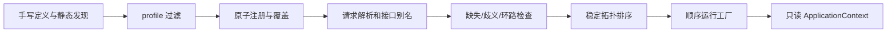

# qubit-ioc 完整设计

> 状态：首版实现对应的规范，2026-09-26。本文是实现与验收的基线；
> [容器内核草案](design.zh_CN.md)与[注解草案](annotation-design.zh_CN.md)保留设计背景，
> 与本文不一致时以本文为准。以下 API 是当前首版的公共契约。

## 1. 目标、边界与术语

`qubit-ioc` 在应用启动时把已注册的组件组成有向依赖图，先验证再构造，成功后
发布只读的 `ApplicationContext`。默认入口是声明式过程宏和静态发现；显式
`ContainerBuilder` 是同一机制的底层入口。Rust 类型系统负责构造与 trait 转换，
容器不通过运行时反射写字段。

首版只提供应用级共享单例、实例注册、同步/异步工厂、构造函数式字段注入、
接口绑定、可选/集合依赖、配置值、profile、确定性诊断和显式覆盖。暂不提供
原型/请求作用域、运行时增删绑定、自动生命周期钩子、循环代理、动态库发现、
条件表达式或配置热更新。`qubit-spi` 继续负责同一服务族的 provider 选择及回退；
`Managed<T>` 可为单个定义显式提供 stop 和可选 wait 动作，普通定义仍由应用管理。
应用可独立使用 `qubit-reflect` 的诊断元数据；
IoC 当前没有反射集成功能，反射也不承担组件构造或发现。

术语：**定义**是一次注册声明；**绑定**是 `(Rust TypeId, 可选 BindingId)` 对应的
一个可查询句柄；**接口别名**是从 `dyn Trait` 绑定指向具体组件的边；**定义来源**
用于排序和报错，绝不是绑定身份；**构建**是验证、拓扑排序与工厂执行的整个过程。

## 2. 包与 feature

仓库形成一个 Cargo workspace，包含 `qubit-ioc` 运行时 crate 和
`qubit-ioc-macros` 过程宏 crate。最低 Rust 版本沿用当前 `Cargo.toml` 的 1.94，
edition 为 2024。运行时依赖不能反向引用宏 crate；宏只生成对运行时公开接口与
`__private::codegen_v1` 的引用。宏使用 `proc-macro-crate` 解析消费方重命名后的
运行时路径；本 crate 内部和集成测试也须可展开。

| feature | 默认 | 作用 |
| --- | --- | --- |
| `macros` | 开 | 重导出 `Component`、`Service`、`Repository`、`Configuration`、`ConfigurationProperties`、`bean`。 |
| `inventory` | 开 | 收集已链接 crate 的声明；关闭后 `discover()` 不可用，宏的手动注册入口仍可用。 |
| `config` | 开 | 启用 `with_config`、`ConfigurationProperties` 和 `#[value]` 所需的 `qubit-config`。 |

`default = ["macros", "inventory", "config"]`；`default-features = false` 的运行时
可以独立完成显式实例/工厂注册和构建，不依赖宏、inventory 或配置。
`macros` 不隐含 `inventory` 或 `config`；宏在缺少必要 feature 时对相应语法给出
明确编译诊断。`inventory` 的提交宏由运行时按自身 feature 控制，生成代码不能
检查消费方的 `cfg(feature = "inventory")`。

## 3. 用户入口与命名

标注结构体、枚举或 trait 的宏统一 CamelCase；标注字段、函数及参数的宏统一
snake_case。模块级 `#[Configuration]` 归入声明级宏。首版没有枚举/trait IoC 宏。

| 宏 | 位置 | 核心属性 | 作用 |
| --- | --- | --- | --- |
| `#[Component]` | 具名字段/单元结构体 | `id`, `bind`, `primary`, `order`, `profile` | 推导字段依赖并注册组件。 |
| `#[Service]`、`#[Repository]` | 同上 | 同上 | `Component` 的诊断类别别名。 |
| `#[bean]` | 模块级自由函数 | `id`, `bind`, `primary`, `order`, `profile`, `type`, `marker` | 同步/异步工厂。 |
| `#[Configuration]` | 内联模块 | `profile` | 为内部 `#[bean]` 提供默认 profile 与手动分组入口。 |
| `#[ConfigurationProperties]` | 具名字段结构体 | `prefix`, `id`, `primary`, `order`, `profile` | 反序列化配置子树。 |
| `#[inject]` | 组件字段/bean 参数 | `id` | 显式注入；`id` 精确选择绑定。 |
| `#[value]` | 组件字段/bean 参数 | 单个配置路径字符串 | 从 `Config` 读取标量。 |

不提供小写的 `#[component]`、`#[service]` 等兼容别名。过程宏入口函数若因
CamelCase 触发 Rust 命名 lint，只在入口函数局部允许该 lint，不影响消费方。
所有选项只允许出现一次；未知项、重复项与错误位置由宏以带 span 的错误报告。

典型使用：

```rust,ignore
use std::sync::Arc;
use qubit_ioc::{ApplicationContext, Component, Service};

trait UserRepository: Send + Sync { fn find(&self, id: u64) -> Option<String>; }

#[Component(bind = dyn UserRepository, id = "example.repository.memory", primary)]
struct MemoryRepository;

impl UserRepository for MemoryRepository {
    fn find(&self, id: u64) -> Option<String> { Some(id.to_string()) }
}

#[Service]
struct UserService { repository: Arc<dyn UserRepository> }

let mut builder = ApplicationContext::builder().discover()?;
builder.root::<UserService>();
let context = builder.build()?;
let service = context.get::<UserService>()?;
```

### 3.1 绑定 ID

`BindingId` 与 `rs-model-metadata` 的
[`#[Entity(id = "...")]` 规则](../../rs-model-metadata/src/model_id.rs)同构：
非空字符串，按 `.` 分段，每段匹配 `[A-Za-z][A-Za-z0-9_]*`；单段也合法。
`example.repository.memory` 和 `Cache2` 合法；空串、空分段、数字开头、空白、
连字符、斜杠和非 ASCII 字符非法。ID 区分大小写并保留原文，不做规范化。
宏只接受字符串字面量并在编译期校验；运行时注册 API 在注册时校验。
省略 `id` 是 `None`，绝不从类型、函数或模块名生成默认 ID。

绑定身份是 `(TypeId, Option<BindingId>)`，因此相同 ID 可用于不同 Rust 类型，
同一类型的相同 ID 只能有一个绑定。一个声明的 ID 同时赋给具体绑定和它的
每个 `bind = dyn Trait` 接口别名；各接口分别拥有类型命名空间。
`primary` 与 `order` 在有 `bind` 时作用于各接口别名，否则作用于具体绑定；
具体绑定仍可通过类型和 ID 精确查询。
`#[inject(id = "...")]` 在目标字段/参数的 Rust 类型命名空间中精确查找同 ID。
缺少 ID 的请求参与唯一候选/primary 解析，不等于只找 `None` 绑定。

### 3.2 字段和参数

宏识别下表中的精确语法形状；路径别名或包装类型由显式工厂处理。`T` 可为具体
类型或满足 `Send + Sync + 'static` 的 trait 对象。

| 形状 | 无 `#[inject]` | `#[inject(id = "...")]` |
| --- | --- | --- |
| `Arc<T>` | 必需单值；唯一候选或唯一 primary。 | 精确 ID，缺失即错误。 |
| `Option<Arc<T>>` | 无候选得 `None`；歧义仍报错。 | 该 ID 缺失得 `None`。 |
| `Vec<Arc<T>>` | 注入所有候选，允许空集合。 | 不支持，编译错误。 |

无参数的 `#[inject]` 与未标记的支持形状等价。普通标量必须使用 `#[value("path")]`
或自定义 `#[bean]`；`#[value]` 与 `#[inject]` 不能同时出现。首版不注入 `&T`、
裸 `T`、`Box<T>`、`Mutex<T>` 或懒加载代理。组件结构体保留原字段可见性；
生成构造逻辑放在原模块内，允许读取私有字段声明。元组结构体、泛型与带生命周期
参数的结构体不作为首版宏输入，但可走底层工厂 API。

`#[value("path")] T` 调用 `Config::get::<T>(path)`，因此 `T: FromConfig`；缺值
与转换错误构建失败。它遵循 `qubit-config` 的直接读取规则，**默认不做插值**；
如果应用需要插值，应在手写工厂中调用 `get_interpolated`，或另行设计明确选项。
`#[ConfigurationProperties(prefix = "...")]` 要求 `DeserializeOwned`，调用
`Config::deserialize::<T>(prefix)`：默认拒绝未知字段且不插值；空 prefix 选择根。
配置来源、覆盖顺序和 `Config` 快照由应用在构建前决定。

### 3.3 工厂与模块

`#[bean]` 支持模块级自由函数，参数使用上述注入形状；返回 `T`、`Arc<T>`、
`Managed<T>`、`Result<T,E>`、`Result<Arc<T>,E>` 或 `Result<Managed<T>,E>`，以及对应
`async fn`。托管输出中的 `Managed` 必须以导入后的单段类型路径书写。`T: Send + Sync + 'static`，
`E: Error + Send + Sync + 'static`。直接返回值包入 `Arc`，已经返回 `Arc` 的工厂
不再包一层；错误保留为 source。`#[bean(type = T)]` 只用于返回值的类型别名，
仍须让宏识别外层 `Result`。不支持 `impl Trait`、泛型函数、方法、接收器、
借用参数、`unsafe`/`extern` 函数和返回嵌套 future 的函数。

`#[Configuration(profile = "prod")]` 仅接受内联模块，把 profile 作为其直接子
`#[bean]` 的默认值；子 bean 明写 profile 时优先。它不拦截 bean 函数之间的
普通调用，也不创建代理。模块只生成一个手动分组注册入口，不另行提交 inventory
项；各 bean 自己提交。模块内若声明用户自己的同名 `register_ioc`，宏报冲突。

每个结构体宏实现公开 `ComponentDefinition::register(&mut ContainerBuilder)`；
手动入口为 `builder.install::<MyComponent>()?`。每个 `#[bean]` 生成同可见性的
零大小 marker 类型，默认按函数名转 PascalCase 后加 `Bean`，例如
`db_pool` → `DbPoolBean`；必要时用 `marker = CustomMarker` 避免同模块命名冲突。
marker 实现同一 `ComponentDefinition`，手动入口是 `builder.install::<DbPoolBean>()?`。
`#[Configuration]` 模块额外生成 `register_ioc(&mut ContainerBuilder)`，按源码顺序
安装直接子 bean。`#[ConfigurationProperties]` 结构体同样实现
`ComponentDefinition`。同一声明既手动安装又被 `discover()` 收集时，按重复绑定
报错，不静默去重。

## 4. 运行时公共 API

下面是必须保持的 API 形状，完整类型和生命周期以编译器可实现形式落地；
若实现必须调整签名，需先同步本文与跨 crate 示例。

```rust,ignore
pub type FactoryFuture<T> = std::pin::Pin<Box<dyn std::future::Future<Output = Result<Arc<T>, FactoryError>> + Send + 'static>>;

impl FactoryError {
    pub fn new<E: std::error::Error + Send + Sync + 'static>(source: E) -> Self;
}

impl ContainerBuilder {
    pub fn new() -> Self;
    pub fn register_instance<T: ?Sized + Send + Sync + 'static>(&mut self, value: Arc<T>) -> Result<(), RegistrationError>;
    pub fn register_factory<T, F>(&mut self, deps: &[Dependency], factory: F) -> Result<(), RegistrationError>
    where T: ?Sized + Send + Sync + 'static,
          F: FnOnce(BuildContext) -> Result<Arc<T>, FactoryError> + Send + 'static;
    pub fn register_async_factory<T, F>(&mut self, deps: &[Dependency], factory: F) -> Result<(), RegistrationError>
    where T: ?Sized + Send + Sync + 'static,
          F: FnOnce(BuildContext) -> FactoryFuture<T> + Send + 'static;
    pub fn install<D: ComponentDefinition>(&mut self) -> Result<(), RegistrationError>;
    pub fn build(self) -> Result<ApplicationContext, BuildError>;
    pub async fn build_async(self) -> Result<ApplicationContext, BuildError>;
    pub fn active_profiles(self, profiles: &[&str]) -> Result<Self, RegistrationError>;
}

impl ApplicationContext {
    pub fn builder() -> ContainerBuilder;
    pub fn get<T: ?Sized + Send + Sync + 'static>(&self) -> Result<Arc<T>, ResolveError>;
    pub fn get_by_id<T: ?Sized + Send + Sync + 'static>(&self, id: &str) -> Result<Arc<T>, ResolveError>;
    pub fn try_get<T: ?Sized + Send + Sync + 'static>(&self) -> Result<Option<Arc<T>>, ResolveError>;
    pub fn get_all<T: ?Sized + Send + Sync + 'static>(&self) -> Vec<Arc<T>>;
}
```

带 ID、primary、order、profile 等选项统一通过公开 `BindingOptions` 传给
`register_*_with` 变体；无 `_with` 的快捷入口使用默认选项。输入选项和请求
保存原始 `Option<String>`，builder 在注册时调用
`BindingId::parse(&str) -> Result<BindingId, InvalidBindingId>`，形成拥有所有权的
已验证 ID；宏额外在编译期校验其字符串字面量。`Dependency::of::<T>()`、
`with_id::<T>(id: &str)`、`optional::<T>()`、
`optional_with_id::<T>(id: &str)`、`all::<T>()` 描述请求类型、ID 和基数。
`BindingOptions` 对外包含 `id: Option<String>`、`primary: bool`、`order: i32` 和
`profile: Option<String>`；来源信息由注册入口生成或由底层显式传入，不让应用
通过伪造来源改变绑定身份。`register_instance_with(value, options)`、
`register_factory_with(deps, options, factory)` 和
`register_async_factory_with(deps, options, factory)` 与快捷入口返回相同错误类型。
`BuildContext` 提供 `get`、`get_by_id`、`try_get`、`get_all`；仅允许读取工厂声明
过且图验证已解析的请求，未声明读取返回 `BuildAccessError`。

`ApplicationContext::get` 与 `BuildContext::get` 都只克隆已构造 `Arc`，不再执行
工厂。对 `dyn Trait` 的显式注册允许 `Arc<dyn Trait>`，类型擦除层必须存储整个
`Arc<T>`，可通过 `Any` 中的 `Arc<T>` 还原宽指针，不能把 trait 对象转换成裸
`Any` 后丢失 vtable。具体组件与接口别名克隆同一 `Arc` 的分配，保持对象身份。

`register_*_with`、`install` 和 `discover` 都在**单个定义的所有键**上原子暂存：
先检查该定义自身的具体键和全部接口键，全部合法后才写入 builder。重试一个失败
定义不会留下部分别名。不同定义的键冲突须在 profile 过滤后统一检查，
因此 active 重复绑定是构建错误。`replace_binding<F>(key, definition)` 的签名约束为
`F: FnOnce(&mut ContainerBuilder) -> Result<(), RegistrationError>`。该一次性闭包
可捕获应用状态并向临时 builder 注册定义；闭包失败、替代定义未声明目标键或声明多次时，
原 builder 保持不变。构建时，按活动 profile 和注册位置检查替代项之前必须恰有一个原绑定；
缺失或多个原绑定分别返回 `BuildError::ReplacementOriginalMissing` 或
`BuildError::ReplacementOriginalAmbiguous`，不运行工厂。后续同键定义仍报 `DuplicateBinding`。
成功后只替换指定精确键，并记录覆盖来源；若要替换一个定义的所有别名，
应先 `exclude_definition::<D>()` 再注册
替代定义。排除在 `discover()` 前声明，按定义身份跳过该定义全部键；不级联移除
依赖它的其他定义，缺失依赖在图验证时报告。

宏生成的 `ComponentDefinition::register` 使用 `__private::codegen_v1::DefinitionDraft`：
先放入具体实例/工厂，再为每个 `bind` 放入由 `Arc<Concrete>` 转换成
`Arc<dyn Trait>` 的别名投影，最后一次性提交给 builder。投影只在具体工厂成功
构造后执行；具体与接口绑定不分别调用工厂。底层手写应用若只需一个接口，
可直接注册 `Arc<dyn Trait>`，不必使用隐藏协议。

## 5. 注册、发现与顺序

默认 `discover(self) -> Result<Self, RegistrationError>` 收集最终二进制已链接 crate
中的静态 `RegistrationEntry`，按 `(package, module_path, file, line, column, item)`
排序后，调用与 `install` 完全相同的注册函数。手写注册按应用调用顺序进入；
一次 `discover()` 内按上述来源顺序进入。多次调用 `discover()` 会尝试重复注册并
在构建时得到重复绑定错误；不把 inventory 的原始迭代顺序当作语义。来源键用于可复现排序与诊断，
同一源码在不同绝对路径构建时不承诺跨机器相同字节序列。

过程宏提交项只含 `const` 可构造的函数指针与静态来源，不在链接或静态初始化
时运行用户工厂。`discover()` 也只注册定义，不构造组件。应用必须显式让定义 crate
进入最终链接产物；单有 Cargo 依赖不保证 inventory 项被链接。关闭 `inventory`
后 `discover()` 在 API 层不可用，手动安装及底层组装继续工作。

profile 是定义过滤器。未标注 profile 的定义总是激活；标注值只在该 profile
被 `active_profiles(...)` 选中时激活。无配置时活跃集合为 `{"default"}`。过滤在
冲突与依赖图验证之前进行，因此两个互斥 profile 的相同键可共存于发现源；
同一次构建里若都激活则报告冲突。手写绑定也可附 profile。profile 是非空 ASCII
标识，按 `[A-Za-z][A-Za-z0-9_-]*` 校验，不使用 BindingId 的点分段语法。

## 6. 图解析与构建



单值无 ID 请求：零候选报缺失；一个候选使用它；多个候选要求恰好一个 primary，
否则报歧义。单值带 ID 请求只匹配精确键，primary 不参与。可选请求零候选得
`None`，非零候选按同一单值规则解析；集合请求取该类型全部候选，按
`(order 升序, ID 升序, 来源键升序)` 排列，`None` ID 在 `Some` 前，空集合合法。
同一类型出现多个 active primary 时，即使没有无 ID 请求也在构建前报错。
同一工厂重复声明完全相同的 `(类型, ID, 基数)` 请求在注册阶段报错。

先把每个请求解析到精确目标，再创建依赖边；可选和集合命中的目标也建边，
接口别名另有指向具体绑定的边。无候选的可选/集合不建边。图必须先完整检查
缺失、歧义、多个 primary 和环路，才调用第一个用户工厂。按进入 builder 的
定义顺序与依赖声明顺序选择首个错误，并保留从根定义到出错点的完整路径。
稳定拓扑排序总让依赖先于消费者；独立节点按注册顺序执行。一个定义无论暴露
多少接口，只构造一次。首版串行构建，不并行运行独立工厂。

`build()` 仅接受实例与同步工厂；若图合法但含 active 异步工厂，在任何工厂
执行前报 `AsyncRequired`。`build_async()` 可混合两类工厂，返回的 future 必须
`Send`，由调用方选择执行器。取消 future 时未启动的工厂不执行，已发生外部
副作用不回滚。`build()` 工厂失败时只 stop 已完成的托管组件，不等待；
`build_async()` 失败时先 stop 再 wait。需要失败回收也等待终止时，即使所有工厂同步，
也应使用 `build_async()`。panic 按 Rust 默认机制传播，不捕获为普通错误。构造失败不发布
部分 context；局部 `Arc` 正常释放。成功后 context 可跨线程共享，组件自身负责
内部可变状态。容器丢弃不承诺资源关闭顺序。

## 7. 错误与诊断

| 阶段 | 错误变体 | 至少保留 |
| --- | --- | --- |
| 注册 | `InvalidBindingId`, `InvalidProfile`, `DuplicateDependency` | 原值/键、定义来源。 |
| 构建验证 | `DuplicateBinding`, `ReplacementOriginalMissing`, `ReplacementOriginalAmbiguous`, `MissingDependency`, `AmbiguousBinding`, `MultiplePrimaryBindings`, `DependencyCycle`, `AsyncRequired` | 请求类型、ID、候选、完整路径和冲突来源。 |
| 构造 | `FactoryFailed`, `ConfigReadFailed` | 定义来源、字段/参数、依赖路径、原始 source。 |
| 工厂访问 | `UndeclaredDependency` | 工厂来源和请求键。 |
| context 查询 | `MissingComponent`, `AmbiguousBinding`, `InvalidBindingId` | 请求类型、ID、可用候选。 |

宏语法错误在编译期报告，并尽量定位到选项、字段或参数。跨 crate 的缺失、歧义、
重复绑定和环路留到启动构建时报告。类型名只用于显示；身份必须使用 `TypeId`。
`FactoryError` 是公共 API 的具体错误包装类型，内部保留原始 `Error` 为 source；
用户工厂返回它，宏生成代码负责把符合约束的 `E` 转成 `FactoryError`。
错误保留 `Error::source` 链，不把领域错误压平成字符串。仅查询/构建错误允许
因 `get` 调用或构建而产生；正常缺失与歧义不 panic。

## 8. 配置、SPI 与反射

启用 `config` 时，`with_config(self, config: qubit_config::Config)
-> Result<Self, RegistrationError>` 把快照作为无 ID `Arc<Config>` 实例注册，
与显式注册同键时按重复绑定处理。配置相关宏都声明 `Config` 依赖；缺少快照
会在运行工厂前给出 `MissingDependency`。单值读取调用
`Config::get::<T>`，结构化读取调用 `Config::deserialize::<T>`；两者都保留
`ConfigError` source。`#[value]` 的字符串是配置路径，不受 BindingId 语法限制。

`qubit-spi::ProviderRegistry<S>` 可以作为普通组件注册；SPI provider 的选择、
优先级与失败回退完全留在 SPI。IoC 工厂可调用 `resolve`/`create_configured`，
只在外层附加依赖路径。不增加对 `qubit-spi` 的直接依赖。

`qubit-reflect` 已有的类型描述符与链接片段是元数据系统，不是组件实例注册表。
核心和宏都不要求 `Reflect`，也没有 `reflect` Cargo feature。应用可自行关联
`TypeDescriptor` 供诊断或工具查询。IoC 不自动初始化反射注册表，不从反射字段
推断依赖，不复用其私有 `codegen_v3` 协议，也不要求修改 `rs-reflect`。

## 9. 宏展开协议与可见性

宏管线固定为 `parse → validate → normalize IR → expand`。IR 至少携带声明种类、
Rust 类型、绑定 ID、接口、profile、order、primary、每个依赖的类型/基数/ID、
配置路径、输出形状、原始 span 与静态来源。parser 拒绝未知属性和不支持语法；
expand 不做跨 crate 候选推断。`bind = dyn Trait` 可重复；具体类型到接口的转换
由生成的 `let alias: Arc<dyn Trait> = concrete.clone();` 交给 Rust 编译器检查。

`#[Component]` 展开保留原结构体，在同模块实现 `ComponentDefinition`，以字段
顺序构造 `Dependency` 列表和结构体字面量工厂。`#[bean]` 保留原函数，剥离
`#[inject]`/`#[value]` 参数属性，生成 marker 与调用函数的工厂。异步函数工厂
返回 boxed future，捕获的是已解析的拥有所有权的 `Arc`。`#[Configuration]`
先解析内联模块再给未写 profile 的直接子 bean 补默认值，避免重复提交。

生成代码只使用 `qubit_ioc::__private::codegen_v1` 中的窄协议；公开用户 API
不能依赖此模块。运行时隐藏 `submit_component!` 在启用 inventory 时提交静态项，
否则展开为空。宏和运行时的协议版本不兼容时通过缺失路径显式编译失败。
定义来源含包名、模块路径、文件及行列；编译诊断保留用户声明的 span。

## 10. 验收矩阵与非目标

| 场景 | 期望 |
| --- | --- |
| 三级依赖逆序注册 | 图验证成功，按依赖顺序构造，每个工厂只运行一次。 |
| 一个组件绑定两个 trait | 两个接口与具体类型拿到同一底层 `Arc`。 |
| 两个同类型 ID 与一个 primary | 无 ID 注入取 primary；`#[inject(id = "...")]` 精确取目标。 |
| 可选/集合依赖 | 缺失可选为 `None`，集合为空；命中目标均参与环路检查。 |
| 缺失/歧义/环路/异步要求 | 第一个工厂运行前失败，错误含稳定来源和路径。 |
| 宏与手写混用、profile、排除/覆盖 | 同一键语义一致；重复键不被静默覆盖。 |
| 跨 crate 静态发现 | 已链接声明可发现；关闭 inventory 后可手动安装。 |
| 配置与 SPI | 配置错误保留 `ConfigError`；SPI 错误保留原 source 链。 |
| 无默认 feature | 纯底层组装不链接宏、inventory 或 config。 |
| 错误语法 | CamelCase/蛇形命名、非法 ID、不支持签名在编译期给出定位错误。 |

这些场景由 `tests/`、`macros/tests/` 和 `tests/fixtures/ioc_cross_crate/` 覆盖。
跨 crate fixture 分别定义 contract、provider 和应用链接入口；额外的 `manual`
包用 `default-features = false` 验证显式装配。后续调整公共签名时，应先同步本文，
再更新代码与跨 crate 示例，不得悄悄改变对外语义。
